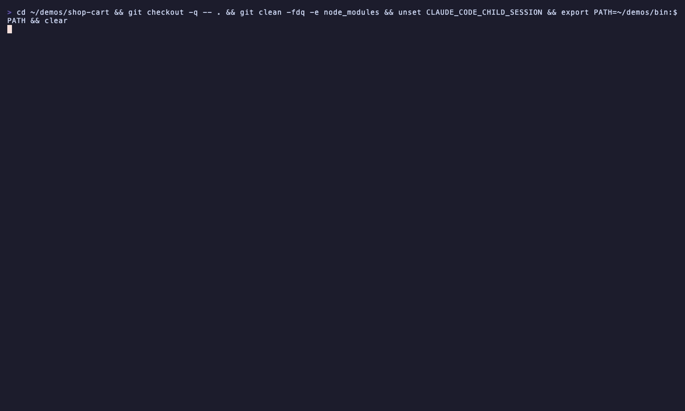

# Red Squiggle



A Claude Code mod that type-checks and lints the file Claude just edited and puts any errors into that same tool result. The model sees broken types on the step that caused them, not three turns later when a test run fails.

Red Squiggle runs after each successful Edit or Write. It skips edits that errored and edits staged for review.

| File | Checker | Notes |
|---|---|---|
| `.ts .tsx .js .jsx .mts .cts .mjs .cjs` | the project's own TypeScript (`node_modules/typescript/bin/tsc`) | Runs `--noEmit --incremental` on the config whose program contains the file. It reads `include`, `exclude`, `files`, `allowJs` and `checkJs` through `extends` (relative, package and array forms) with real glob matching, and recursively follows `references`. A file that no glob takes, but that may be in a program through an import, is checked against the nearest config, and `--listFiles` decides. A build-info file goes under `node_modules/.cache/red-squiggle/`. |
| same | the project's own `node_modules/.bin/eslint` | Only when an eslint config exists. Runs from that config's folder with `--format json --quiet`, so it reports errors only. |
| `.py` | `ruff check --no-fix` | Uses `.venv/bin/ruff`, then `venv/bin/ruff`, then `ruff` on PATH. JSON output. |

- **Only new errors.** Red Squiggle keeps a baseline of what each checker reported, counted per error, so a second identical error still shows. The first time it sees a project or file in a session, it takes the baseline just before the edit. If that fails, the first run after the edit becomes the baseline and nothing is reported as new. The model sees errors this edit introduced in the file, plus errors it newly broke in *other* files (tsc). Errors that were already there are counted, not repeated. Every error in a newly created file counts as new.
- The output reaches the model as quoted context after the tool result, capped at 20 lines and marked as data, not instructions.
- The status line shows `✓ file clean`, `✗ N errors in file`, or how many errors are new in other files. "Clean" means the file was proven to be in the program tsc checked (`--listFiles`). A file outside every program, or a run cut off before it proves the file was checked, reports nothing rather than "clean". Paths are compared through their real spelling (`/tmp` vs `/private/tmp`).
- Fail-open. If a checker is missing, crashes or times out (default 30 s), or if anything else after the write throws, the edit's result comes back untouched.
- Only one tsc runs per project at a time. Edits that arrive during a run share a single follow-up run.
- Project lookups stop at the repository root (`.git`). It never installs anything or falls back to `npx`.

## Settings

`/config` lists `tsc`, `eslint` and `ruff` toggles and `timeoutSeconds`.

## Install

```
/plugin marketplace add ccdwyer/claude-mods
/plugin install red-squiggle@ccdwyer-mods
/reload-plugins
```

## Develop

```
claude plugin validate .
claude plugin test .
```
